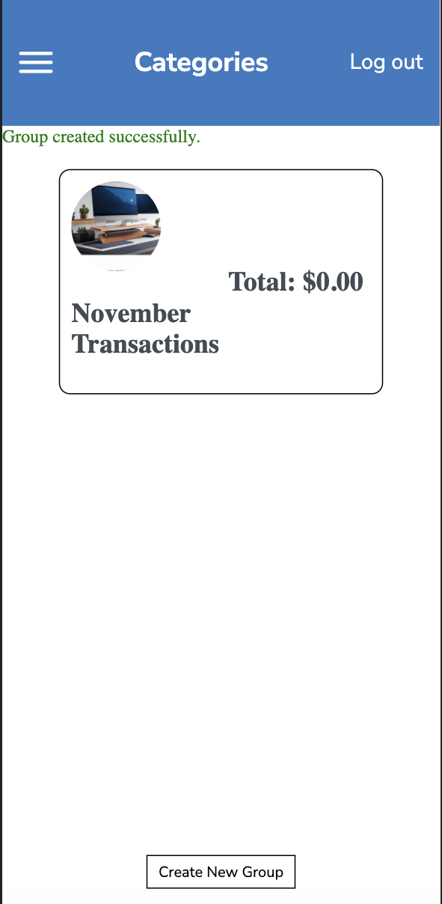
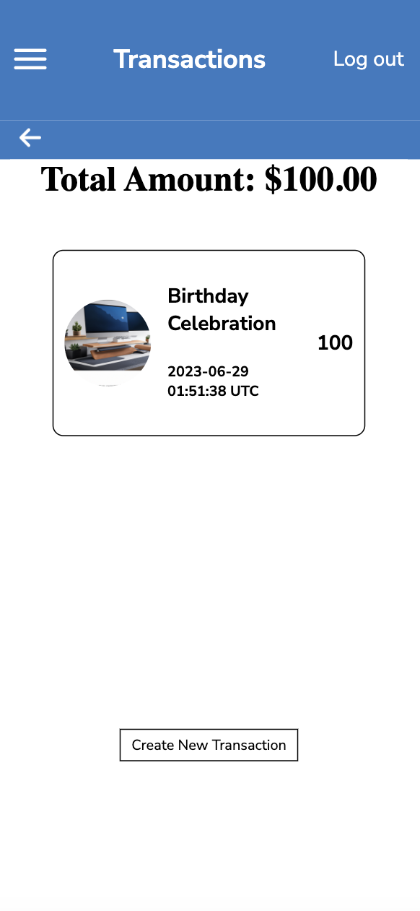
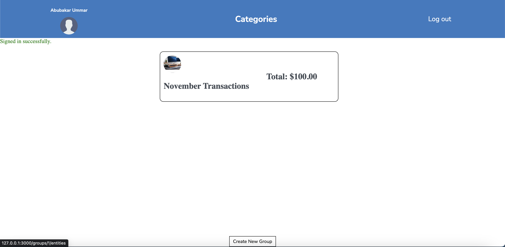
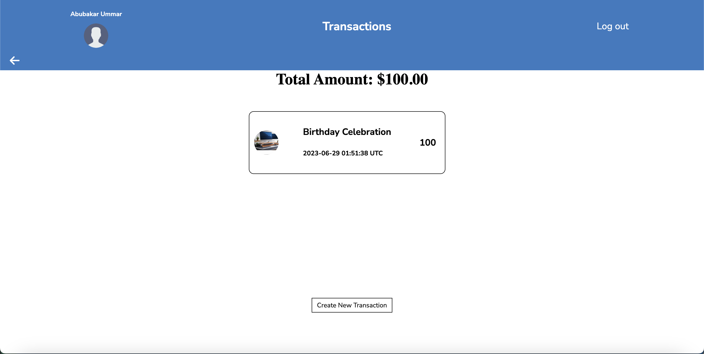

<a name="readme-top"></a>


# 📗 Table of Contents

- [📗 Table of Contents](#-table-of-contents)
- [Budget-App ](#budget-app-)
  - [🛠 Built With ](#-built-with-)
    - [Tech Stack ](#tech-stack-)
    - [Key Features ](#key-features-)
    - [Screenshot](#screenshot)
  - [🚀 Live Demo ](#-live-demo-)
  - [💻 Getting Started ](#-getting-started-)
    - [Prerequisites](#prerequisites)
    - [Setup](#setup)
    - [Installation](#installation)
    - [Usage](#usage)
    - [Run tests](#run-tests)
  - [👥 Authors ](#-authors-)
  - [🔭 Future Features ](#-future-features-)
  - [🤝 Contributing ](#-contributing-)
  - [⭐️ Show your support ](#️-show-your-support-)
  - [📝 License ](#-license-)

<!-- PROJECT DESCRIPTION -->

# Budget-App <a name="about-project"></a>

**Budget-App** is a full-stack web application developed using Ruby on Rails. It provides user authentication with login and logout functionality, allowing users to securely access their data. With Budget-App, users can add categories to organize their expenses and incomes, and then add transactions for each category to keep track of their spending. The application also features a modern and visually appealing design that enhances the user experience.

## 🛠 Built With <a name="built-with"></a>

### Tech Stack <a name="tech-stack"></a>

> Developed using Ruby on Rails.
<details>
  <summary>Languages</summary>
  <ul>
    <li><a href="https://www.ruby-lang.org/en/">Ruby</a></li>
  </ul>
    <ul>
    <li><a href="https://rubyonrails.org/">Rails</a></li>
  </ul>
</details>

### Key Features <a name="key-features"></a>
- **Register and login features**
- **Database where you can add categories and transactions**
- **Implemented design from the sneak peek wireframe**

### Screenshot







## 🚀 Live Demo <a name="live-demo"></a>

- [Live Demo](https://budgetapp-ml67.onrender.com)

- [Live Video Link](https://youtu.be/hr4TgtRkKzc)

## 💻 Getting Started <a name="getting-started"></a>
> To get a local copy up and running, follow these steps.

### Prerequisites

In order to run this project you need:

- You need to have ruby on rails installed in your computer.

### Setup
Clone this repository to your desired folder:
```
- To clone the repository run this command - "https://github.com/seniortechdev/budget-app.git"
- cd budget-app
```
### Installation
Install this project with:
```
- bundle install
```

### Usage
To run the project, execute the following command:
```
- rails server
```

### Run tests
To run tests, run the following command:
```
- rspec
```
## 👥 Authors <a name="authors"></a>

- GitHub: [@seniortechdev](https://github.com/https://github.com/seniortechdev)

<!-- FUTURE FEATURES -->

## 🔭 Future Features <a name="future-features"></a>

> These are some of the future features we want to add.

- [ ] ***Add a remove button for categories***
- [ ] ***Add a remove button for each transaction***
- [ ] ***Add a all transactions page***

## 🤝 Contributing <a name="contributing"></a>

Contributions, issues, and feature requests are welcome!

Feel free to check the [issues page](../../issues/).


## ⭐️ Show your support <a name="support"></a>

Give a ⭐️ if you like this project!

## 📝 License <a name="license"></a>

This project is [MIT](./LICENSE) licensed.

<p align="right">(<a href="#readme-top">back to top</a>)</p>
